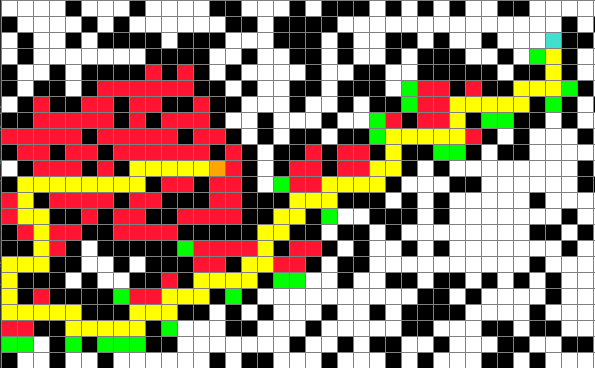

# PathFinder

A* Pathfinder algorithm visualization following shortest path Manhattan approach.

## Usage

```python
pip install pygame
```
```python
python Pathfinder.py
```

## Instructions
- First left click on grid places the start position (ORANGE).
- Second left click places the end position or destination (BLUE).
- Consecutive left clicks place walls/barriers (BLACK) that can not be crossed. Use this for drawing mazes.
- Right click on any color placed to remove it from grid
- Space bar to trigger the execution of algorithm over the grid
- 'C' key to clear the grid
- 'M' key to generate a maze 

## Preview
   
